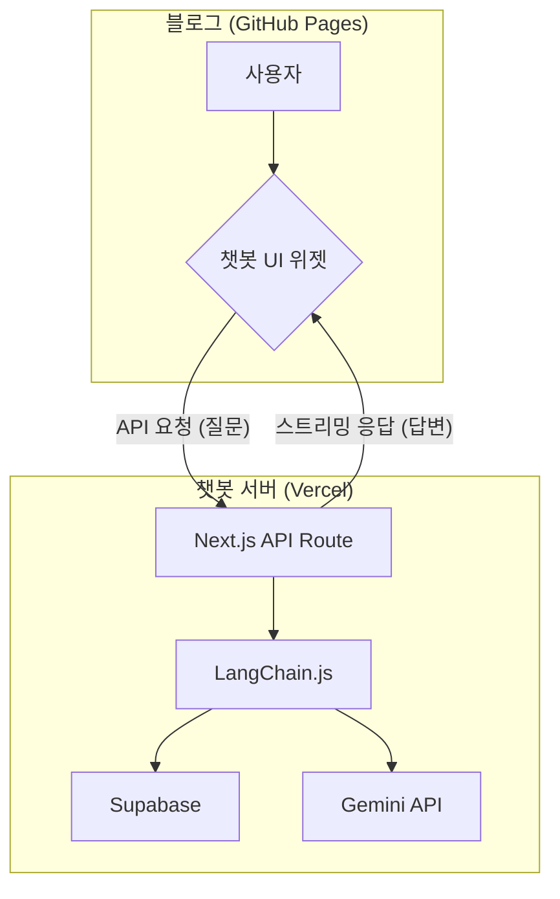

# 프로젝트 '잇츠 미(It's me)' 설계 문서

> 최종 수정일: 2025년 8월 16일
> 작성자: (당신의 이름 또는 깃허브 ID)

## 1. 배경 (Problem)

기존의 텍스트 기반 이력서는 지원자의 경험과 역량을 일방적으로 전달할 뿐, 상호작용이 불가능하다. 채용 담당자는 정해진 정보 외에 추가적으로 궁금한 점을 즉시 해소할 수 없어, 지원자에 대한 입체적인 이해에 한계가 있다. 이는 지원자에게는 자신의 강점을 충분히 어필할 기회를, 채용 담당자에게는 효율적인 정보 탐색의 기회를 제약하는 문제로 이어진다.

## 2. 목표 (Goals)

-   최신 AI 기술(RAG)을 활용하여, 상호작용이 가능한 새로운 형태의 포트폴리오를 제시한다.
-   채용 담당자에게 동적이고 깊이 있는 정보 탐색 경험을 제공하여, 지원자의 기술적 깊이와 문제 해결 능력을 효과적으로 어필한다.
-   독립적으로 동작하고, 다른 웹사이트에 쉽게 통합될 수 있는 재사용 가능한 '챗봇 위젯'을 개발한 경험을 포트폴리오로 남긴다.

## 3. 핵심 기능 요구사항 (Key Features)

-   **RAG 기반 질의응답**: 사용자의 자연어 질문에 대해, 미리 준비된 개인 데이터를 기반으로 정확한 답변을 생성한다.
-   **다국어 지원**: 한국어와 일본어를 모두 지원하며, 사용자가 직접 언어를 선택할 수 있는 UI 토글을 제공한다.
-   **독립 실행 및 임베딩**: Vercel에 배포된 자체 주소로 독립적으로 동작하는 동시에, 외부 사이트(블로그)에 스크립트 태그로 삽입될 수 있는 구조를 갖는다.
-   **향상된 UX**:
    -   **환영 메시지**: 첫 방문 시, 챗봇이 먼저 대화를 시작하여 사용자의 참여를 유도한다.
    -   **타이핑 애니메이션**: AI가 답변을 생성하는 동안 실시간 스트리밍 효과를 제공하여 생동감을 부여한다.
    -   **이미지 답변**: 특정 질문에 대해 텍스트와 함께 관련 이미지를 표시하여 이해를 돕는다.
    -   **답변 복사 기능**: 각 답변별로 내용을 쉽게 복사할 수 있는 버튼을 제공한다.
-   **지능적인 예외 처리**: 데이터 범위를 벗어난 질문 시, 안내 메시지와 함께 대화를 이어나갈 추천 질문을 제시한다.

## 4. 기술 설계 (Technical Design)

### 4.1. 시스템 아키텍처

-   **'두뇌(API)'와 '얼굴(UI)'을 분리**하는 아키텍처를 채택하여, 독립성과 통합성을 동시에 확보한다.
-   **두뇌 (API 서버)**: Next.js API Route를 사용해 RAG 파이프라인을 구현한다. 독립된 `its-me` 리포지토리에서 관리하며, Vercel에 배포하여 고정된 API 엔드포인트를 제공한다.
-   **얼굴 (UI 위젯)**: React 컴포넌트로 UI를 구현한다. 최종적으로 다른 사이트에 삽입될 수 있는 단일 JavaScript 파일로 빌드되며, API 서버와 네트워크 통신을 통해 동작한다.

### 4.2. 기술 스택 (Tech Stack)

  - **Frontend**: Next.js, React, TypeScript, Tailwind CSS, Vercel AI SDK
  - **Backend**: Next.js API Routes (Serverless)
  - **AI**: Google Gemini, LangChain.js
  - **Database**: Supabase (pgvector)
  - **Deployment**: Vercel

## 5. 리스크 및 해결 방안 (Risks & Mitigation)

  - **리스크**: AI가 데이터에 없는 내용을 답변하는 환각(Hallucination) 현상 발생 가능성.
  - **해결 방안**: Supabase 벡터 검색 시 유사도 점수(Similarity Score) 임계값을 설정한다. 검색된 데이터의 점수가 임계값보다 낮을 경우, AI에 질문을 보내지 않고 미리 준비된 안내 메시지와 추천 질문을 출력하도록 처리한다.