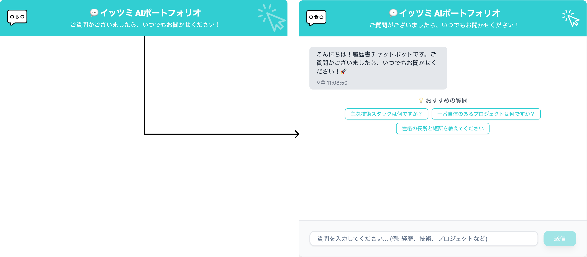
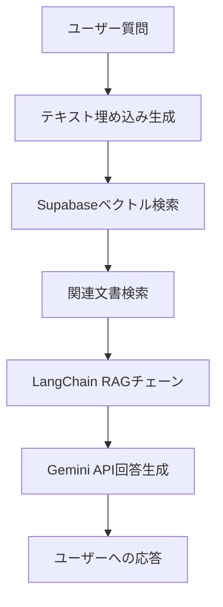
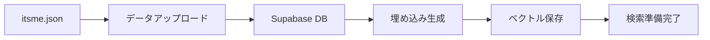
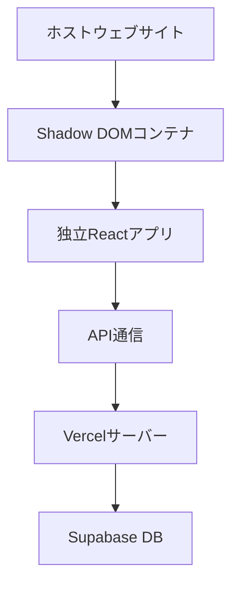
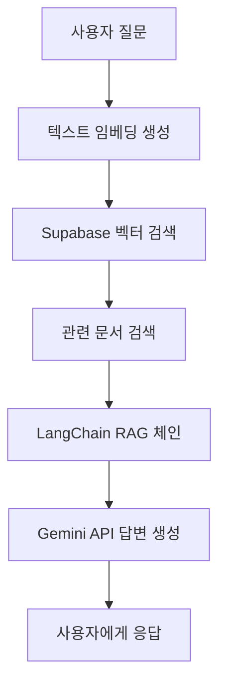
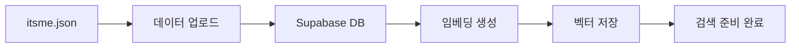
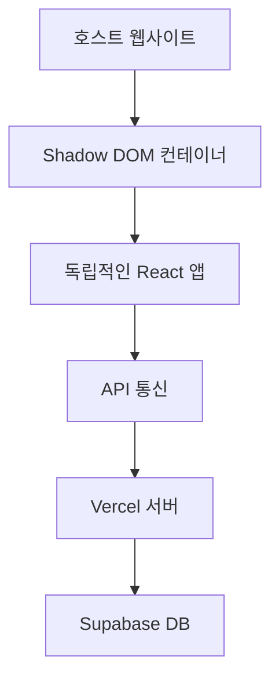

# Its Me - AI基盤の対話型ポートフォリオチャットボット

> RAG（Retrieval Augmented Generation）技術を活用した個人ポートフォリオチャットボット



## 🎯 プロジェクト概要

**Its Me**は、個人情報と経験をAIが理解し、自然に対話できる対話型ポートフォリオチャットボットです。外部ウェブサイトに独立したウィジェットとして埋め込み可能で、Shadow DOMを通じて完全なスタイル分離を提供します。

### 核心特徴
- 🤖 **RAG基盤の知的回答**: ベクトル検索とAI生成を組み合わせた正確な回答
- 🌐 **外部サイト埋め込み**: どのウェブサイトにも独立して挿入可能
- 🎨 **完全なスタイル分離**: Shadow DOMによるCSS衝突防止
- 🌍 **多言語対応**: 韓国語/日本語自動検出および回答
- 🌙 **ダークモード対応**: ライト/ダークテーマ動的切り替え

## 🛠 技術スタック

### AI & Machine Learning
- **Google Gemini API**
- **LangChain.js**
- **Supabase pgvector**

### Backend
- **Next.js 14**
- **Supabase**
- **TypeScript**

### Frontend & Widget
- **React 18**
- **Tailwind CSS**
- **Vite**
- **Shadow DOM**

### Deployment & Infrastructure
- **Vercel**

## 🏗 アーキテクチャ

### RAGシステムフロー


### データパイプライン


### ウィジェット埋め込み構造


## ⚡ 主要技術特徴

### 1. Shadow DOMによるCSS分離
```typescript
// 完全なスタイル分離実装
const shadowRoot = container.attachShadow({ mode: 'open' });
const appRoot = document.createElement('div');
shadowRoot.appendChild(appRoot);
```

ホストサイトのCSSと完全に分離された独立したウィジェット環境を提供します。

### 2. ベクトル検索基盤の知的回答
- **閾値**: 0.5以上の類似度スコア
- **検索アルゴリズム**: HNSWインデックスを活用した高速ベクトル検索
- **埋め込みモデル**: Google Gemini Embedding 001

### 3. リアルタイム推奨質問システム
- **タグ基盤マッチング**: 質問内容に応じた関連推奨質問生成
- **重複除去**: 使用された質問は自動フィルタリング
- **頻度基盤優先順位**: 検索結果のタグ頻度に基づくスマートマッチング

## 🚀 開発ワークフロー

### 1. データ管理
```bash
# 新しい質問/回答追加後
npm run upload-data    # Supabaseにデータアップロード
npm run embeddings     # ベクトル埋め込み生成
```

### 2. ウィジェットビルド
```bash
npm run build:widget   # ウィジェットビルドおよびpublic/widget.js生成
```

### 3. デプロイ
```bash
git push origin main   # Vercel自動デプロイ
```

## 📁 プロジェクト構造

```
its-me/
├── src/
│   ├── app/
│   │   ├── api/chat/          # RAG APIエンドポイント
│   │   └── globals.css        # ウィジェットスタイル
│   ├── components/
│   │   └── chatbot/           # チャットボットUIコンポーネント
│   ├── data/
│   │   ├── itsme.json         # 個人情報データ
│   │   └── suggestions.json   # 推奨質問設定
│   └── widget/                # ウィジェットエントリーポイント
├── scripts/
│   ├── upload-data.js         # データアップロード
│   └── generate-embeddings.js # 埋め込み生成
└── public/
    └── widget.js              # ビルドされたウィジェットファイル
```

## 🎨 ウィジェット使用方法

### HTML埋め込み
```html
<div id="its-me-chatbot-container"></div>
<script src="https://unpkg.com/react@18/umd/react.development.js"></script>
<script src="https://unpkg.com/react-dom@18/umd/react-dom.development.js"></script>
<script src="https://its-me-vert.vercel.app/widget.js?lang=ja&theme=dark"></script>
```

### Reactコンポーネント
Next.jsやReactアプリでは、動的スクリプトローディングを使用してコンポーネントとして利用できます。

# Its Me - AI 기반 대화형 포트폴리오 챗봇

> RAG(Retrieval Augmented Generation) 기술을 활용한 개인 포트폴리오 챗봇

## 🎯 프로젝트 개요

**Its Me**는 개인 정보와 경험을 AI가 이해하고 자연스럽게 대화할 수 있는 대화형 포트폴리오 챗봇입니다. 외부 웹사이트에 독립적인 위젯으로 임베딩 가능하며, Shadow DOM을 통해 완전한 스타일 격리를 제공합니다.

### 핵심 특징
- 🤖 **RAG 기반 지능형 답변**: 벡터 검색과 AI 생성을 결합한 정확한 답변
- 🌐 **외부 사이트 임베딩**: 어떤 웹사이트에도 독립적으로 삽입 가능
- 🎨 **완전한 스타일 격리**: Shadow DOM을 통한 CSS 충돌 방지
- 🌍 **다국어 지원**: 한국어/일본어 자동 감지 및 응답
- 🌙 **다크모드 지원**: 라이트/다크 테마 동적 전환

## 🛠 기술 스택

### AI & Machine Learning
- **Google Gemini API**
- **LangChain.js**
- **Supabase pgvector**

### Backend
- **Next.js 14**
- **Supabase**
- **TypeScript**

### Frontend & Widget
- **React 18**
- **Tailwind CSS**
- **Vite**
- **Shadow DOM**

### Deployment & Infrastructure
- **Vercel**

## 🏗 아키텍처

### RAG 시스템 플로우


### 데이터 파이프라인


### 위젯 임베딩 구조


## ⚡ 주요 기술적 특징

### 1. Shadow DOM을 통한 CSS 격리
```typescript
// 완전한 스타일 격리 구현
const shadowRoot = container.attachShadow({ mode: 'open' });
const appRoot = document.createElement('div');
shadowRoot.appendChild(appRoot);
```

호스트 사이트의 CSS와 완전히 분리된 독립적인 위젯 환경을 제공합니다.

### 2. 벡터 검색 기반 지능형 답변
- **임계값**: 0.5 이상의 유사도 점수
- **검색 알고리즘**: HNSW 인덱스를 활용한 고속 벡터 검색
- **임베딩 모델**: Google Gemini Embedding 001

### 3. 실시간 추천 질문 시스템
- **태그 기반 매칭**: 질문 내용에 따른 관련 추천 질문 생성
- **중복 제거**: 사용된 질문은 자동으로 필터링
- **빈도 기반 우선순위**: 검색 결과의 태그 빈도에 따른 스마트 매칭

## 🚀 개발 워크플로우

### 1. 데이터 관리
```bash
# 새 질문/답변 추가 후
npm run upload-data    # Supabase에 데이터 업로드
npm run embeddings     # 벡터 임베딩 생성
```

### 2. 위젯 빌드
```bash
npm run build:widget   # 위젯 빌드 및 public/widget.js 생성
```

### 3. 배포
```bash
git push origin main   # Vercel 자동 배포
```

## 📁 프로젝트 구조

```
its-me/
├── src/
│   ├── app/
│   │   ├── api/chat/          # RAG API 엔드포인트
│   │   └── globals.css        # 위젯 스타일
│   ├── components/
│   │   └── chatbot/           # 챗봇 UI 컴포넌트
│   ├── data/
│   │   ├── itsme.json         # 개인 정보 데이터
│   │   └── suggestions.json   # 추천 질문 설정
│   └── widget/                # 위젯 엔트리포인트
├── scripts/
│   ├── upload-data.js         # 데이터 업로드
│   └── generate-embeddings.js # 임베딩 생성
└── public/
    └── widget.js              # 빌드된 위젯 파일
```

## 🎨 위젯 사용법

### HTML 임베딩
```html
<div id="its-me-chatbot-container"></div>
<script src="https://unpkg.com/react@18/umd/react.development.js"></script>
<script src="https://unpkg.com/react-dom@18/umd/react-dom.development.js"></script>
<script src="https://its-me-vert.vercel.app/widget.js?lang=ko&theme=dark"></script>
```

### React 컴포넌트
Next.js나 React 앱에서는 동적 스크립트 로딩을 사용해서 컴포넌트로 활용할 수 있습니다.
